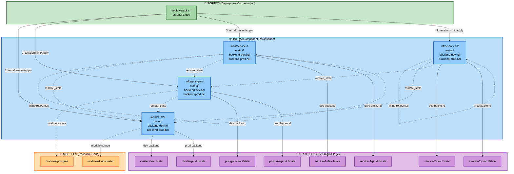

# Terraform Multi-Region Infrastructure with Component-Based Architecture

This repository demonstrates a **component-based architecture** for managing multi-region, multi-stage Kubernetes infrastructure using KIND clusters locally. It showcases separation of concerns with reusable modules, separate state files per component/stage, and orchestrated deployments.

## Architecture Principles

This project demonstrates:
- **Independent Team Ownership**: Each component (cluster, postgres, service-1, service-2) has its own state file per stage, enabling different teams to deploy independently
- **Reusable Modules**: Shared Terraform modules (`kind-cluster`, `postgres`) used across environments
- **Remote State Sharing**: Components reference each other's outputs via `terraform_remote_state` for loose coupling
- **Backend Configuration**: Uses `-backend-config` for switching between dev/prod state files
- **Bash Orchestration**: Scripts coordinate deployment order while maintaining component independence

### Architecture Diagram



**Key Concepts:**
- **MODULES**: Reusable Terraform code defining resources (what to create)
- **INFRA**: Component instances using modules with backend configs (how to deploy)
- **SCRIPTS**: Orchestration layer that deploys components with proper dependencies
- **STATES**: Each component has separate state files per stage for team ownership

### Project Structure

```
terraform-stack/
├── README.md                         # This file
├── modules/                          # Reusable Terraform modules
│   ├── kind-cluster/                 # KIND cluster module
│   │   ├── main.tf                   # Cluster resources
│   │   ├── variables.tf
│   │   └── outputs.tf
│   ├── postgres/                     # PostgreSQL database module
│   │   ├── main.tf                   # Database resources
│   │   ├── variables.tf
│   │   └── outputs.tf
│   └── services/                     # Reusable service module (optional)
│       ├── main.tf
│       ├── variables.tf
│       └── outputs.tf
├── infra/                            # Component instantiation (team ownership)
│   ├── cluster/                      # Platform team owns this
│   │   ├── main.tf                   # Uses kind-cluster module
│   │   ├── variables.tf
│   │   ├── outputs.tf
│   │   ├── backend-dev.hcl           # Dev backend config
│   │   ├── backend-prod.hcl          # Prod backend config
│   │   └── states/                   # State files per stage
│   │       ├── cluster-dev.tfstate
│   │       └── cluster-prod.tfstate
│   ├── postgres/                     # Database team owns this
│   │   ├── main.tf                   # Uses postgres module + remote_state
│   │   ├── variables.tf
│   │   ├── outputs.tf
│   │   ├── backend-dev.hcl
│   │   ├── backend-prod.hcl
│   │   └── states/
│   │       ├── postgres-dev.tfstate
│   │       └── postgres-prod.tfstate
│   ├── service-1/                    # Service-1 team owns this
│   │   ├── main.tf                   # Inline resources + remote_state
│   │   ├── variables.tf
│   │   ├── outputs.tf
│   │   ├── backend-dev.hcl
│   │   ├── backend-prod.hcl
│   │   └── states/
│   │       ├── service-1-dev.tfstate
│   │       └── service-1-prod.tfstate
│   └── service-2/                    # Service-2 team owns this
│       ├── main.tf                   # Inline resources + remote_state
│       ├── variables.tf
│       ├── outputs.tf
│       ├── backend-dev.hcl
│       ├── backend-prod.hcl
│       └── states/
│           ├── service-2-dev.tfstate
│           └── service-2-prod.tfstate
├── deployments/                      # Deployment tfvars files (optional)
│   ├── us-east-1-dev.tfvars
│   ├── us-east-1-prod.tfvars
│   ├── us-west-2-dev.tfvars
│   ├── us-west-2-prod.tfvars
│   ├── eu-west-1-dev.tfvars
│   └── eu-west-1-prod.tfvars
└── scripts/                          # Deployment orchestration (optional)
    ├── deploy-stack.sh               # Deploy full stack (region + stage)
    ├── destroy-stack.sh              # Destroy full stack
    ├── deploy-single.sh              # Deploy single deployment
    ├── deploy-service-1.sh           # Redeploy service-1
    ├── deploy-service-2.sh           # Redeploy service-2
    ├── setup-clusters.sh             # Setup all clusters
    └── cleanup.sh                    # Cleanup all resources
```

**Key Points:**
- Each team manages their own component directory under `infra/`
- State files are isolated per component and per stage (dev/prod)
- Scripts are optional - teams can deploy directly with Terraform CLI
- Modules are shared and reusable across all components

## Infrastructure Overview

The infrastructure deploys:
- **KIND Cluster**: Single cluster per region-stage combination
- **PostgreSQL Database**: Deployed in cluster with stage-appropriate resources
- **Two Application Services**: service-1 (nginx) and service-2 (httpd), both connected to the database

Each component has separate state files per stage (dev/prod) for independent team ownership.

## Prerequisites

- [Docker](https://docs.docker.com/get-docker/)
- [Terraform](https://developer.hashicorp.com/terraform/downloads) (>= 1.0)
- [kubectl](https://kubernetes.io/docs/tasks/tools/) (optional, for verification)

## Quick Start

### Deploy Full Stack (Region + Stage)

```bash
# Deploy a complete stack for a specific region and stage
./scripts/deploy-stack.sh us-east-1 dev

# Deploy production stack
./scripts/deploy-stack.sh us-east-1 prod
```

This will deploy all 4 components in order:
1. Cluster infrastructure (KIND cluster + namespace)
2. PostgreSQL database
3. Service-1 (nginx)
4. Service-2 (httpd)

### Destroy Full Stack

```bash
# Destroy all components for a specific region and stage
./scripts/destroy-stack.sh us-east-1 dev
```

### Deploy Individual Components (Team Independence)

Each team can deploy their component independently:

```bash
# Platform team: Deploy just the cluster
cd infra/cluster
terraform init -reconfigure -backend-config="backend-dev.hcl"
terraform apply -var="cluster_name=cluster-us-east-1-dev" \
  -var="region=us-east-1" \
  -var="stage=dev" \
  -var="host_port=30000"

# Database team: Deploy just postgres (requires cluster to exist)
cd infra/postgres
terraform init -reconfigure -backend-config="backend-dev.hcl"
terraform apply -var="cluster_state_path=../cluster/states/cluster-dev.tfstate"

# Service team: Deploy just service-1 (requires cluster and postgres)
cd infra/service-1
terraform init -reconfigure -backend-config="backend-dev.hcl"
terraform apply \
  -var="cluster_state_path=../cluster/states/cluster-dev.tfstate" \
  -var="postgres_state_path=../postgres/states/postgres-dev.tfstate"
```

## Adding New Regions

To add a new region, update the deploy/destroy scripts with the new region-stage combination:

1. **Add the host port mapping** in `scripts/deploy-stack.sh`:
   ```bash
   case "${REGION}-${STAGE}" in
       "ap-southeast-1-dev")    HOST_PORT=30300 ;;
       "ap-southeast-1-prod")   HOST_PORT=30301 ;;
       # ... existing mappings
   ```

2. **Deploy the new region**:
   ```bash
   ./scripts/deploy-stack.sh ap-southeast-1 dev
   ```

## Configured Regions

The following region-stage combinations are pre-configured in the deployment scripts:

| Region | Stage | Host Port |
|--------|-------|-----------|
| us-east-1 | dev | 30000 |
| us-east-1 | prod | 30001 |
| us-west-2 | dev | 30100 |
| us-west-2 | prod | 30101 |
| eu-west-1 | dev | 30200 |
| eu-west-1 | prod | 30201 |

## Scripts

| Script | Purpose |
|--------|---------|
| `scripts/deploy-stack.sh <region> <stage>` | Deploy full stack for a region-stage |
| `scripts/destroy-stack.sh <region> <stage>` | Destroy full stack for a region-stage |
| `scripts/setup-clusters.sh` | Deploy all configured region-stage combinations |
| `scripts/cleanup.sh` | Destroy all deployed clusters |
| `scripts/deploy-single.sh <deployment>` | Deploy using legacy tfvars file |
| `scripts/deploy-service-1.sh <region> <stage>` | Redeploy service-1 to a specific cluster |
| `scripts/deploy-service-2.sh <region> <stage>` | Redeploy service-2 to a specific cluster |

## Components

### infra/cluster
- Creates KIND cluster with 1 control-plane + 2 worker nodes
- Sets up Kubernetes namespace (`app-{stage}`)
- Configures node labels for region/stage
- Uses `modules/kind-cluster`

### infra/postgres
- Deploys PostgreSQL database
- Creates persistent volume claims
- Sets up database secrets
- Reads cluster state via `terraform_remote_state`
- Uses `modules/postgres`

### infra/service-1 & infra/service-2
- Deploys application services (nginx/httpd)
- Configures database connectivity via ConfigMaps
- Manages service scaling based on stage
- Reads cluster and postgres state via `terraform_remote_state`
- Inline resource definitions (no module)

## Verification

```bash
# List all KIND clusters
docker ps

# Access a specific cluster using the generated kubeconfig
export KUBECONFIG=infra/cluster/cluster-us-east-1-dev-config
kubectl get all -n app-dev

# View cluster state outputs
cd infra/cluster
terraform init -reconfigure -backend-config="backend-dev.hcl"
terraform output

# View postgres state outputs
cd infra/postgres
terraform init -reconfigure -backend-config="backend-dev.hcl"
terraform output
```

## Benefits of This Architecture

1. **Team Independence**: Each team can deploy their components independently without coordination
   - Platform team manages `infra/cluster/`
   - Database team manages `infra/postgres/`
   - Application teams manage `infra/service-1/` and `infra/service-2/`
2. **Separate State Files**: Each component/stage combination has isolated state for safety and ownership
3. **Reusability**: Modules are shared across stages (dev/prod) and can be versioned
4. **Loose Coupling**: Components reference each other via `terraform_remote_state`, not direct dependencies
5. **Flexibility**: Deploy/destroy individual components without affecting others
6. **Different Deployment Cadences**: Teams can deploy on their own schedule without blocking others

## Troubleshooting

**Docker not running**: Start Docker Desktop or Docker daemon

**Backend configuration error**: Use `-reconfigure` flag when switching between dev/prod:
```bash
terraform init -reconfigure -backend-config="backend-dev.hcl"
```

**Remote state not found**: Ensure dependent components are deployed first (cluster → postgres → services)

**Permission denied on scripts**: Make scripts executable:
```bash
chmod +x scripts/*.sh
```

**PVC timeout**: The postgres PVC uses `wait_until_bound = false` to avoid timeouts with KIND's WaitForFirstConsumer storage class
